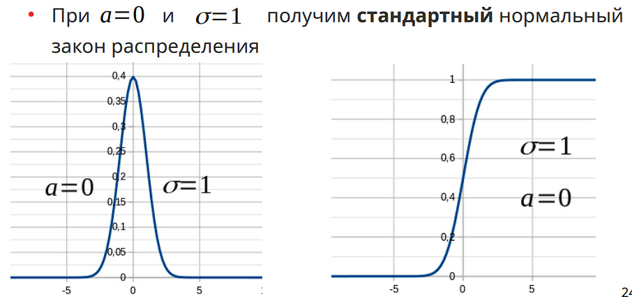
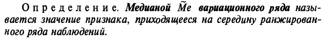
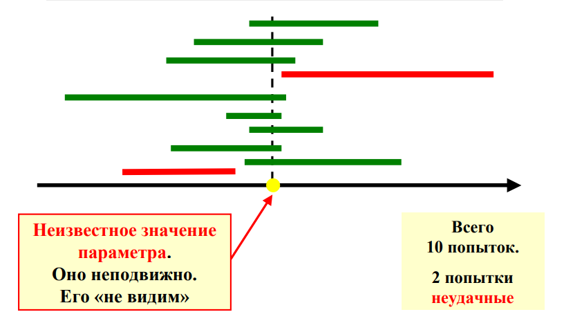

# Теория вероятности и математическая статистика

## Тема 1. Случайные события и вероятность

### Случайные события

- Случайное событие (событие) — любой факт, который в
результате опыта (испытания) может произойти либо не
произойти

- Опыт (испытание) — то, результат чего непредсказуем точно

- Исход опыта — результат опыта. Взаимоисключающие
исходы образуют элементарные события

- События обозначаются заглавными латинскими буквами

- Достоверное событие — это событие, которое в опыте
происходит обязательно. Обозначается символом Ω

- Невозможное событие — это событие, которое в опыте
никогда не происходит. Обозначается символом ∅

Пример. Опыт - 1 раз брошен кубик

- Событие «выпало меньше 10 очков» - достоверное

- Событие «выпало больше 10 очков» - невозможное

- Полная группа событий — это совокупность событий, хотя
бы одно из которых в опыте обязательно происходит

- Два события называют несовместными, если в опыте они
не могут произойти одновременно

- Два события называют совместными, если в опыте они
могут произойти одновременно

- Несколько событий называют попарно несовместными, если в опыте никакие два из них не могут произойти одновременно
- Несколько событий называют несовместными в совокупности, если в опыте все они не могут произойти одновременно
- Если события попарно несовместные, то они обязательно
несовместные в совокупности
- Если события несовместные в совокупности, то они не
обязательно попарно несовместные
- Два события называют равными, если в опыте одно из них
происходит только тогда, когда происходит другое событие. В
противном случае события неравные
- Равные события: $A=B$
- Неравные события: $A≠B$
- Принято считать, что невозможное событие равно
невозможному событию: $∅=∅$

- Два события называют равновозможными, если есть
основание считать, что ни одно из этих событий не является
объективно более возможным, чем другое
- Несовместные и равновозможные события, образующие полную группу, называют случаями (шансами)

- Противоположное событие для события A — это событие, которое в опыте происходит только тогда, когда не происходит событие A

- Обозначение: $Ā$

- Противоположные события являются несовместными и
образуют полную группу

- Событие A влечёт за собой событие B, если в опыте событие
В обязательно происходит, когда происходит событие A

- Обозначение:$A⊂B$

- Исход называют благоприятным некоторому событию, если
появление этого исхода влечёт за собой появление данного
события
## Примеры опытов и событий

- Опыт — один раз брошен кубик
    – Событие A — выпало 5 очков
    – Событие В — выпало меньше 4 очков
    – Событие С — выпало чётное число очков
    – Всего исходов опыта 6
- Опыт — один раз подброшена монета
    – Событие А — выпал «орёл»
    – Событие В — выпала «решка»
    – Всего исходов опыта 2

- Опыт — произведено n выстрелов по мишени
–Событие А — 5 попаданий в цель
–Событие В —  попаданий в цель < 3
–Исходы опыта:
- $n$ попаданий, $n-m$ промахов
- Всего исходов  $2^n$ : нужно подсчитать все возможные комбинации из промахов и попаданий при заданном $n$

## Операции над событиями

- Сумма событий  $ A_{1},A_{1},...,A_{n} $ это событие, которое
происходит тогда, когда в опыте происходит хотя бы одно из $ A_{1},A_{1},...,A_{n} $ событий
- Обозначение: $ A_{1} + A_{1} + ... + A_{n} $
- Для совместных событий A и B событие             означает или
наступление события A, или наступление события B, или обоих
событий вместе
- Для несовместных событий A и B их сумма означает либо
наступление события A, либо наступление события B
$A+B$

- Произведение событий  $ A_{1},A_{1},...,A_{n} $ это событие, которое
происходит тогда, когда в опыте одновременно происходят все $ A_{1},A_{1},...,A_{n} $
события
- Обозначение:
$ A_{1} * A_{1} *...* A_{n} $

- Разность событий A и B  - это событие, которое происходит
тогда, когда в опыте событие A произойдёт, а событие B не
произойдёт
- Обозначение:  $A−B$

### Классическое определение вероятности

- Согласно классическому определению вероятность события A
равна отношению числа исходов, благоприятствующих
событию A, к общему числу исходов
- Обозначение:

$P(A)$ - вероятность события A
$k$ - число исходов, благоприятствующих событию A
$n$ - общее число исходов опыта

### Свойства вероятности

- Вероятность любого события заключена между 0 и 1:
$0⩽P(A)⩽1$
- Вероятность достоверного события равна 1:
$P(Ω)=1$
- Вероятность невозможного события равна 0:
$P(∅)=0$

### Принцип практической уверенности

- События, вероятности которых очень малы (близки к нулю) или
очень велики (близки к единице), называются соответственно
практически невозможными или практически достоверными
событиями

### Статистическое определение вероятности

- Классическая формула не всегда позволяет рассчитать
вероятность события. Поэтому для оценки вероятности события
применяют другой подход
- Статистическая вероятность события A - это относительная
частота появления этого события в n проведённых испытаниях:

m — число испытаний, в которых появилось событие A
n — общее число испытаний

### Сходимость по вероятности

- X n сходится по вероятности к величине a ,
если при сколь угодно малом ε вероятность неравенства
Величина $|X n −a|<ε$ с увеличением
- n неограниченно приближается к единице

При увеличении числа опытов частота события не стремится к
вероятности события, а сходится к ней по вероятности:

### Элементы комбинаторики

- Пусть $А_i (i=1,2 ,... ,n)$ - элементы конечного множества
- Правило суммы. Если элемент $A_1$ можно выбрать $n_1$ способами,
элемент $A_2$ - $n_2$ способами, элемент $A_k - n_k$ способами, то выбор одного из элементов: или
$A_1$ , или $A_2 ,…, $или $A_k$ может быть осуществлён $n_1 +n_2 +...+n_k $ способами

- Правило произведения. Если элемент $A_1$ можно выбрать $n_1$ способами, после этого элемент $A_2$ может быть выбран $n_2$ способами и т.д., после каждого $(k−1)$ выбора элемент $Ak$ может быть выбран $nk$ способами, то выбор всех элементов $A_1 , A_2 ,... , A_k$ в указанном порядке может быть осуществлён
$n_1⋅n_2⋅...⋅n_k$ способами

## Тема 2. Основные теоремы теории вероятностей

### Теорема сложения вероятностей

Вероятность суммы **двух несовместных** событий равна сумме вероятностей
этих событий:

**P (A + B) = P(A) + P(B)**

Вероятность суммы событий **трех попарно несовместных** событий равна
сумме вероятностей этих событий:

**P (A + B + C) = P(A) + P(B) + P(C)**

Общий случай теоремы для n событий:

**P
(**$\sum_{\mathbf{i\  = \ 1}}^{\mathbf{n}}\mathbf{A}_{\mathbf{i}}$**)=**$\mathbf{\ }\sum_{\mathbf{i\  = \ 1}}^{\mathbf{n}}{\mathbf{P(}\mathbf{A}_{\mathbf{i}}\mathbf{)}}$

Вероятность суммы **двух совместных** событий выражается формулой:

**P(A + B) = P(A) + P(B) -- P(A \* B)**

Вероятность суммы **трех совместных** событий вычисляется по формуле:

**P(A + B + C) = P(A) + P(B) + P(C) -- P(A\*B) - P(A\*C) -- P (B\*C) --
P(A \* B \* C)**

### Следствия теоремы сложения вероятностей

**Следствие 1**: если события A1, A2, A3...An образуют полную группу
попарно несовместных событий, то сумма их вероятностей равна единице:

$\sum_{\mathbf{i}\mathbf{\  = \ 1}}^{\mathbf{n}}{\mathbf{P}\mathbf{(}\mathbf{A}_{\mathbf{i}}\mathbf{)}}$
**= 1**

**Следствие 2**: Сумма вероятностей противоположных событий равна
единице:

**P(A) + P(**$\overline{\mathbf{A}}$**) = 1**

### Зависимые и независимые события

- Событие A называется независимым от события B, если
вероятность события A не зависит от того, наступило или нет
событие B.

- Событие A называется зависимым от события B, если
вероятность события A меняется в зависимости от того,
произошло или нет событие B.

- Опыт — бросание двух монет.
  - Событие A — появление герба на первой монете
  - Событие В — появление герба на второй монете
  - Вероятность события A не зависит от того, произошло
  событие B или нет

- В урне два белых шара и один чёрный. Опыт — два человека
извлекают из урны по одному шару.
    -Событие А — появление белого шара у первого человека
    -Событие В — появление белого шара у второго человека
    -События A и B — зависимые

### Условная вероятность

- Вероятность события A, которая зависит от того, произошло
или нет событие B, называют условной вероятностью
события A

$P( A∣B)$

- Обозначение:

- $P( A∣B)=P( A )$ - события A и B независимые

- $P( A∣B)≠P( A )$ - события A и B зависимые

### Теорема умножения вероятностей

- Вероятность произведения двух событий равна
произведению вероятности одного из них на условную
вероятность другого, вычисленную при условии, что первое
имело место

$P( AB)= P( A) P(B∣A)$
$P( AB)= P(B) P ( A∣B)$
$P ( AB)
P( A∣B)=
P(B)$

- Вероятность произведения трёх событий определяется
формулой
$P( ABC )= P( A) P (B∣A ) P(C∣AB)$

- Если события A, B и C — независимые, то
$P( AB)= P( A) P (B)$
$P( ABC )= P( A) P (B) P (C)$

### Следствия теоремы умножения вероятностей

- Следствие 1. Если событие A не зависит от события B, то и
событие B не зависит от события A, т. е. если

$P( A)=P ( A∣B)$
то и
$- P(B)=P (B∣A)$

Следствие 2. Вероятность произведения двух независимых
событий равно произведению вероятностей этих событий

$P( AB)= P( A) P (B)$

### Формула полной вероятности

- Формула полной вероятности является следствием теорем
сложения и умножения вероятностей

- Пусть событие A может произойти вместе с одним из
образующих полную группу несовместных событий

$ H_{1},H_{2},...,H_{n} $ (их называют гипотезами)

- Вероятность события A вычисляется по формуле
n

$P( A)=∑ P( H i ) P( A∣H i )
i=1$

### Формула Байеса

Дана полная группа несовместных событий **H1, H2, ..., Hn** и их
вероятности до проведения опыта:

**P(H1), P(H2),...,P(Hn)**

Проведен опыт, в результате которого состоялось событие **А**. Найти
**P(Hi \| A)** можно по формуле Байеса:

$$\mathbf{P(}\mathbf{H}_{\mathbf{i}}\mathbf{\ |\ A) =}\frac{\mathbf{P(}\mathbf{H}_{\mathbf{i}}\mathbf{)*P(}\mathbf{A\ |\ H}_{\mathbf{i}}\mathbf{)}}{\sum_{\mathbf{i\  = \ 1}}^{\mathbf{n}}{\mathbf{P(}\mathbf{H}_{\mathbf{i}}\mathbf{)*P(}{\mathbf{A\ |\ }\mathbf{H}}_{\mathbf{i}}\mathbf{)}}}$$

- Теорема гипотез позволяет пересчитать вероятности
гипотез при наступлении события (после проведения опыта)

- Наступление события позволяет получить новую
информацию, которая позволяет корректировать
выдвинутые гипотезы (вероятность гипотез)

### Повторение опытов

- Повторение опытов часто встречается на практике

- Требуется уметь определять не результат каждого опыта в
отдельности, а результат серии испытаний

- Несколько опытов называются независимыми, если
вероятность того или иного исхода каждого из опытов не
зависит от того, какие исходы имели другие опыты

- В противном случае — опыты зависимые

### Примеры независимых опытов

- Последовательные подбрасывания монеты

- Последовательные вынимания карты из колоды с
последующим её возвращением и перемешиванием

- Серия выстрелов при условии, что каждый раз после
выстрела осуществляется прицеливание

### Теоремы о повторении опытов

- Если вероятность события A не изменяется от опыта к опыту,
то имеет место частная теорема о повторении опытов

- Если вероятность события A каждый раз различна при серии
испытаний, то имеет место общая теорема о повторении
опытов

### Частная теорема о повторении опытов

Если вероятность события $\mathbf{А}$ не изменяется от опыта к опыту, то
имеет место **частная теорема о повторении опытов**.

Если производится $\mathbf{n}$ независимых опытов, в каждом из которых
событие $\mathbf{А}$ появляется с вероятностью p, то вероятность Pm, n
того, что событие $\mathbf{А}$ появится ровно $\mathbf{m}$ раз,
выражается формулой:

$$\mathbf{P}_{\mathbf{m}\mathbf{,}\mathbf{n}}\mathbf{=}\mathbf{C}_{\mathbf{n}}^{\mathbf{m}}\mathbf{*}\mathbf{p}^{\mathbf{m}}\mathbf{*}\mathbf{q}^{\mathbf{n}\mathbf{-}\mathbf{m}}\mathbf{,\ где\ }\mathbf{q}\mathbf{\  = \ 1 - \ }\mathbf{p}$$

Формулу выше называют $\mathbf{схемой\ Бернулли}$.

Вероятности $\mathbf{P}_{\mathbf{m}\mathbf{,}\mathbf{n}} $являются членами разложение бинома
${\mathbf{(}\mathbf{p}\mathbf{\  + \ }\mathbf{q}\mathbf{)}}^{\mathbf{n}}$

Если в каждом опыте из серии может произойти одно из событий **A1, A2,... Ak**, с соответствующей вероятностью **p1,p2,...,pk**, то вероятность появления **m1** раз события **A1, m2** раз события **A2,mk** раз события **Akm** определятся полиномиальной схемой:
$$\mathbf{P(}\mathbf{m}_{\mathbf{1}}\mathbf{,}\mathbf{m}_{\mathbf{2}}\mathbf{,...,}\mathbf{m}_{\mathbf{k}}\mathbf{) =}\frac{\mathbf{n!}}{\mathbf{m}_{\mathbf{1}}\mathbf{!\ *\ }\mathbf{m}_{\mathbf{2}}\mathbf{\ !...,*}\mathbf{m}_{\mathbf{k}}\mathbf{!}}\mathbf{p}_{\mathbf{1}}^{\mathbf{m}_{\mathbf{1}}}\mathbf{*}\mathbf{p}_{\mathbf{2}}^{\mathbf{m}_{\mathbf{2}}}\mathbf{*...*}\mathbf{p}_{\mathbf{k}}^{\mathbf{m}_{\mathbf{k}}}$$

**n =**
$\mathbf{m}_{\mathbf{1}}\mathbf{\  + \ }\mathbf{m}_{\mathbf{2}}\mathbf{\  + \ ...\  +}\mathbf{m}_{\mathbf{k}}\mathbf{\ \ \ \ \ \ \ \ \ \ \ \ \ \ \ \ \ \ \ \ \ \ \ \ \ }\mathbf{p}_{\mathbf{1}}\mathbf{+}\mathbf{p}_{\mathbf{2}}\mathbf{+ ... +}\mathbf{p}_{\mathbf{k}}\mathbf{= 1}$

### Общая теорема о повторении опытов
Если вероятность события $\mathbf{А}$ каждый раз различна при серии
испытаний, то имеет место **общая теорема о повторении опытов**.

Если в каждом опыте вероятность появления события $\mathbf{А}$ различна,
то применяется общая теорема о повторении опытов.

Пусть проводятся n независимых опытов, в каждом из которых может
появиться или не появиться событие $\mathbf{А}$. Вероятность появления
события $\mathbf{А\ }$в опыте $\mathbf{i}$ равна $\mathbf{pi}$,
вероятность непоявления события $\mathbf{А}$
$\mathbf{равна\ }\mathbf{q}_{\mathbf{i}}\mathbf{\  = \ 1\ –\ }\mathbf{p}_{\mathbf{i}}$.

Общая теорема о повторении опытов выражается формулой:

$$\prod_{\mathbf{i}\mathbf{\  = \ 1}}^{\mathbf{n}}\left( \mathbf{q}_{\mathbf{i}}\mathbf{+}\mathbf{p}_{\mathbf{i}}\mathbf{*}\mathbf{z} \right)\mathbf{\  = \ }\sum_{\mathbf{m}\mathbf{\ \  = 0}}^{\mathbf{n}}{\mathbf{P}_{\mathbf{m}\mathbf{,}\mathbf{n}}\mathbf{*}}\mathbf{z}^{\mathbf{m}}$$

Вероятность того, что событие А в n независимых опытах появится ровно m
раз, равна коэффициенту при
$\mathbf{z}^{\mathbf{m}}\mathbf{\ }$($\mathbf{z}$ -- произвольный
параметр).

Выражение
$\mathbf{fi}\mathbf{(}\mathbf{z}\mathbf{)\  = \ }\prod_{\mathbf{i}\mathbf{\  = \ 1}}^{\mathbf{n}}\left( \mathbf{q}_{\mathbf{i}}\mathbf{+}\mathbf{p}_{\mathbf{i}}\mathbf{*}\mathbf{z} \right)$
называют производящей функцией вероятностей
$\mathbf{R}_{\mathbf{m}\mathbf{,\ }\mathbf{n}}\mathbf{.}$

Общая теорема обращается в частную
при$\mathbf{\ }\mathbf{p}_{\mathbf{1}}\mathbf{\  = \ }\mathbf{p}_{\mathbf{2}}\mathbf{= \ \ldots\  = \ }\mathbf{p}_{\mathbf{n}}\mathbf{.}$

Пусть событие $\mathbf{C}_{\mathbf{m}}$ состоит в том, что событие **А**
появилось не менее **m** раз. Тогда вероятность этого события
$\mathbf{R}_{\mathbf{m}\mathbf{,}\mathbf{n}}$**.**

### Теорема Пуассона (закон редких событий)

Теорема Пуассона:

Если вероятность $\mathbf{p}$ наступления события. $\mathbf{А}$ в каждом
испытании стремится к нулю при неограниченном увеличении $\mathbf{n}$,
то вероятность $\mathbf{P}_{\mathbf{m}\mathbf{,}\mathbf{n}}$
определяется соотношением:

$$\mathbf{P}_{\mathbf{m}\mathbf{,}\mathbf{n}}\mathbf{\approx}\frac{\mathbf{\lambda}^{\mathbf{m}}\mathbf{*}\mathbf{e}^{\mathbf{- \lambda}}}{\mathbf{m!}}\mathbf{=}\mathbf{P}_{\mathbf{m}}\mathbf{(\lambda)\ }$$

### Теорема Муавра-Лапласа

**Локальная теорема Муавра -- Лапласа:**

Если вероятность р наступления события. **А** в каждом испытании
постоянна, отлична от нуля и единицы, то вероятность
$\mathbf{P}_{\mathbf{m}\mathbf{,}\mathbf{n}}$ определяется формулой:

$$\mathbf{P}_{\mathbf{m,n}}\mathbf{\approx}\frac{\mathbf{\varphi(x)}}{\sqrt{\mathbf{n\ *\ p\ \ q}}}$$

Функцию $\mathbf{\varphi}$ **(x)** называют функцией Гаусса.

## Тема 3.1. Случайные величины и их характеристики

### Понятие случайной величины

- Случайная величина — это величина, которая в результате
опыта может принять то или иное заранее неизвестное
значение

- Примеры
  - Число попаданий при трёх выстрелах
  - Число вызовов, поступивших диспетчеру за сутки
  - Координаты точки попадания при выстреле

- Удобно связать случайное событие со случайной величиной:
  - Событие А происходит — 1 , не происходит — 0
  - Событие В — попадание точки с координатами в $(x , y)$ окружность радиуса $r$.
  Вероятность события B — это вероятность выполнения
  неравенства

- Случайной величиной $X$ называют функцию $f ( ω )$ элементарного события
$X=f ( ω )$
- Значение случайной величины определяется исходом $ω$
случайного испытания
- Событие X < x эквивалентно множеству всех тех $ω$ , для
которых выполняется неравенство $f ( ω )< x$

### Дискретные и непрерывные случайные величины

- Дискретные случайные величины (ДСВ) — принимают только
отделённые друг от друга значения, которые можно
занумеровать:
  - число появлений герба при трёх бросаниях монеты
  - число отказавших элементов в приборе
  - число сбитых в бою самолётов

- Непрерывные случайные величины (НСВ) — принимают
любое значение из заданного промежутка (таких значений
бесконечно много):
  - координата точки попадания при выстреле
  - ошибка при измерениях расстояния
  - время безотказной работы прибора

### Закон распределения

- Законом распределения случайной величины называется
всякое соотношение, устанавливающее связь между
возможными значениями случайной величины и
соответствующими им вероятностями

- Закон распределения может быть задан в разных формах

### Формы закона распределения

- Ряд распределения — подходит только для ДВС

- Многоугольник распределения - подходит только для ДВС

- Функция распределения — универсальный способ задания
случайной величины

- Плотность распределения — подходит для НСВ

- Случайная величина считается заданной, если задан её
закон распределения

### Ряд распределения

- Рассмотрим ДСВ $X$. В результате опыта величина $X$ обязательно должна принять только одно из значений
x 1 , x 2 ,... , x n

- Их вероятности обозначим соответственно
$P(X = x 1)= p1 , P(X =x 2)= p2 ,... , P( X= x n)= pn$

Ряд распределения полностью задаёт дискретную случайную
величину

### Функция распределения

- Функция распределения случайной величины X — это функция

F (x) одной переменной x, принимающей любые
действительные значения

X= x , а X < x

- Будем рассматривать события не

- Функция распределения — это вероятность того, что
случайная величина X примет значение, меньшее аргумента
функции x:

- F (x)=P( X < x)

Функция распределения задаёт как дискретные, так и
непрерывные случайные величины

### Свойства функции распределения

- Функция распределения F (x) есть неубывающая функция, т. е.

x 2 > x 1 F (x 2)≥ F (x 1)

- На минус бесконечности функция распределения принимает
значение 0

- F (−∞)=0

На плюс бесконечности функция распределения принимает
значение 1

F (+∞)=1

### Интерпретация свойств функции распределения

- Случайная величина X — случайная точка на числовой оси

- F (x) есть вероятность, что случайная точка X в результате
опыта будет расположена левее x

- Перемещая x влево по оси, уменьшаем вероятность
попадания точки X левее x ( F ( x)→0)

- Перемещая x вправо по оси, увеличиваем вероятность
попадания точки X левее x ( F ( x)→1)

### График функции распределения

- В общем случае график функции распределения — график
неубывающей функции, значения которой расположены в
отрезке [0,1]

- В отдельных точках функция
может иметь разрывы
(скачки)

### Функция распределения НСВ

- Для непрерывной случайной величины составить ряд
распределения нельзя

- Вероятность любого отдельного значения НСВ равна нул

такие события появляются при рассмотрении опытов, не
сводящихся к схеме случаев

имеет место вероятность события

X <a

Функция распределения НСВ
### Вероятность попадания НСВ на заданный участок

[ α,β)

- Рассмотрим полуинтервал

- Попадание случайной величины данный полуинтервал
равносильно неравенству

- Рассмотрим события

A : X <β
B : X <α
C : α ≤ X <β

α ≤ X <β

A , B и С такие, что
A=B+C

Вероятность попадания НСВ на
заданный участок

- По теореме сложения вероятностей

P( A)=P (B+C)=P(B)+ P(C)
  - - P( X < β)=P( X < α )+ P( α ≤ X < β )
Используя функцию распределения можно записать

F (β )=F ( α )+ P ( α ≤ X < β)

- Из последнего следует

P( α ≤ X < β )=F (β )− F ( α )

Вероятность попадания НСВ на
заданный участок

- Вероятность попадания случайной величины на заданный
участок равна приращению функции распределения на этом
участке

- Рассмотрим предел
P( X = α )=lim P( α ≤ X <β )=lim [ F ( β )−F ( α )]
β→ α

β→α

F (x)имеет разрыв в точке x= α , то предел равен
значению скачка функции в точке α

–

Если

–

Если

F (x) непрерывна в точке α , то предел равен нулю

### Плотность распределения

- Пусть F ( x) - непрерывна и дифференцируема

- Вычислим вероятность

P(x< X < x +Δ x)= F (x+Δ x)−F (x)

- Разделим на

Δ x, устремим Δ x к нулю и найдём предел
F ( x+Δ x )−F (x )
lim
=F ' (x)
Δx
Δ x →0

- f (x)= F ' (x) - функция плотности распределения

- Кривая, изображающая плотность распределения, называется кривой распределения

- Плотность распределения существует только для непрерывных случайных величин

- Вероятность попадания
случайной величины X на
заштрихованный участок равна

f (x)dx

  - - f (x)dx - элемент вероятности
dx - элементарный участок

### Связь плотности и функции распределения

- Вероятность попадания
случайной величины X на
заштрихованный участок равна
площади заштрихованной
области
β

- P ( α < X < β )=∫ f ( x ) dx
α

- x

F ( x )= ∫ f ( x ) dx
−∞

### Свойства функции плотности

функция распределения величина безразмерная

плотность распределения имеет размерность, обратную
размерности случайной величины

### Числовые характеристики случайных величин

- Для описания случайной величины иногда бывает достаточным
указать числовые характеристики, которые в сжатой форме
отражают наиболее существенные её особенности
распределения

# Пример Стандартный нормальный закон распределения. Правило трёх сигм

# Система двух случайных величин. Функция распределения

**Определение**: Кортеж \<X, Y\> случайных величин X и Y,
рассматриваемых совместно, называется системой двух случайных величин.

 **Функция распределения системы двух случайных
величин.**

**Определение**:

Функция распределения системы \<X, Y\> случайных величин (дискретных или
непрерывных) -- это функция, значение F(x, y) которой для любых
действительных x и y равно вероятности того, что одновременно истинны
неравенства X \< x и Y \< y,

Т.е F(x, y) = P(X \< x, Y \< y). (Запятую можно условно заменить союзом
и).

Всегда F(x, y) -- это неубывающая функция x и y (т.к F(x, y) -- это
вероятность).

0 \<= F(x, y) \<= 1

При любых действительных x и y.

# Числовые характеристики системы двух случайных величин

Числовые характеристики системы двух случайных величин

$$\alpha_{ks}\lbrack X,\ Y\rbrack\ \beta_{ks}\lbrack X,\ Y\rbrack$$

Основные изучаемые понятия

1) Начальный момент системы двух случайных величин

2) Центральный момент системы двух случайных величин

3) Ковариация системы двух случайных величин

4) Коэффициент корреляции системы двух случайных величин

5) Коррелированные случайные величины

6) Некоррелированные случайные величины

Числовые характеристики системы двух случайных величин

Пусть:

Х -- дискретная случайная величина с реализациями $x_{1},x_{2}...x_{m};$

Y -- дискретная случайная величина с реализациями $y_{1},y_{2}...y_{m};$

Пусть система \<X, Y\> имеет распределение вероятностей:

{\<$x_{1},y_{1},p_{11}$\>,
\<$x_{1},y_{2},p_{12} > ,..., < x_{m},y_{n},p_{mn} >$},

Где
$p_{ij}\  = \ P(X = \ x_{i},\ Y\  = \ y_{i});\ i\  = \ 1,\ 2,\ 3...m$; j
= 1, 2, 3...n.

# Дискретный вариационный ряд и его графическое изображение

**Случайная величина** -- Признак, **Реализация случайной величины** --
Вариант

Абсолютная частота варианта -- сколько раз встречается конкретный
вариант.

Частоты вариантов (относительная частота) -- абсолютная частота варианта
/ общее число вариантов.

Дискретный вариационный ряд для абсолютных частот:

  -----------------------------------------------------------------------
  Вариант                              Абсолютная частота варианта
  ------------------------------------ ----------------------------------
  2                                    2

  3                                    4

  4                                    3

5                                    1
  -----------------------------------------------------------------------

Дискретный вариационный ряд для относительных частот:

  -----------------------------------------------------------------------
  Вариант                             Отн. частота
  ----------------------------------- -----------------------------------
  2                                   0,2

  3                                   0,4

  4                                   0,3

5                                   0,1
  -----------------------------------------------------------------------

**Полигон** -- это многоугольник, график, на котором отображаются по
вертикали -- абсолютная частота варианта, по горизонтали -- вариант.

Это график для абсолютных частот:

Накопленная абсолютная частота для значения Х.

  -----------------------------------------------------------------------
  Значение х                Накопленная абсолютная частота для значения х
  ------------------------- ---------------------------------------------
  1                         0

  2                         0

  2,1                       2

  3                         2

  3,7                       6

  4                         6

  4,2                       9

  5                         9

  5,5                       10

6                         10
  -----------------------------------------------------------------------

В правом столбце содержится кол-во абсолютных частот вариантов, меньших
варианту х.

То же самое можно сделать и для частот:

  -----------------------------------------------------------------------
  Значение х          Накопленная частота для значения х
  ------------------- ---------------------------------------------------
  1                   0

  2                   0

  2,1                 0,2

  3                   0,2

  3,7                 0,6

  4                   0,6

  4,2                 0,9

  5                   0,9

  5,5                 1

6                   1
  -----------------------------------------------------------------------

В правом столбце -- сумма частот вариантов, меньших х.

Как это отобразить:

Строим *кумуляту.*

Строим отдельно для абсолютных частот и относительных.

Накопленная абсолютная частота для значения х, равного варианту

  -----------------------------------------------------------------------
  Значение х                          Накопленная абсолютная частота для
                                      значения х
  ----------------------------------- -----------------------------------
  2                                   0

  3                                   2

  4                                   6

5                                   9
  -----------------------------------------------------------------------

Кумулята для относительных частот:

  -----------------------------------------------------------------------
  Значение х                          Накопленная частота для значения х
  ----------------------------------- -----------------------------------
  2                                   0

  3                                   0,2

  4                                   0,6

5                                   0,9
  -----------------------------------------------------------------------

# Интервальный вариационный ряд и его графическое изображение

Пример про рост студентов:

Рассмотрим интервальный вариационный ряд.

Ранжированные варианты:

  -------------------------------------------------------------------------------
  160     163     168     170     174     175     177     184     189     195
  ------- ------- ------- ------- ------- ------- ------- ------- ------- -------

  -------------------------------------------------------------------------------

  ------------------------------------------------------------------------
  Вариант                 Абсолютная частота      Относительная частота
  ----------------------- ----------------------- ------------------------
  160                     1                       0,1

  163                     1                       0,1

  168                     1                       0,1

  170                     1                       0,1

  174                     1                       0,1

  175                     1                       0,1

  177                     1                       0,1

  184                     1                       0,1

  189                     1                       0,1

195                     1                       0,1
  ------------------------------------------------------------------------

Группируем варианты:

Разбиваем по интервалу

Число интервалов:

$$k = 1 + \left| 0,5 + {log_{2}}n \right|$$

Длина интервала:

$$L = \backslash frac\{ x\_\{ max\} - x\_\{ min\}\}\{ k\}$$

Для нашего случая:

K = 1 + $0,5\  + \ \log_{2}10$ = 4 -- число интервалов

L = (195 - 160) / 4 = 8,75 см.

Интервалы

Составим абсолютные частоты для
интервалов:

  -----------------------------------------------------------------------
  Интервал, см             Абсолютная частота для интервала
  ------------------------ ----------------------------------------------
  \[160; 168,75\]          3

  \[168,75; 177,5\]        4

  \[177,5; 186,25\]        1

\[186,25; 195\]          2
  -----------------------------------------------------------------------

Относительные частоты для интервалов:

  -----------------------------------------------------------------------
  Интервал, см                        Частота для интервала
  ----------------------------------- -----------------------------------
  \[160; 168,75\]                     0,3

  \[168,75; 177,5\]                   0,4

  \[177,5; 186,25\]                   0,1

\[186,25; 195\]                     0,2
  -----------------------------------------------------------------------

Получили интервальный вариационный ряд для абсолютных частот и
относительных частот.

Дальше строим ненормированную гистограмму:

Ненормированная гистограмма -- сумма площадей всех столбиков не равна
единице (в общем случае).

Считаем накопленную абсолютную частоту:

  -----------------------------------------------------------------------
  Интервал, см                        Накопленная абсолютная частота для
                                      интервала
  ----------------------------------- -----------------------------------
  \[160; 168,75\]                     3

  \[168,75; 177,5\]                   7

  \[177,5; 186,25\]                   8

\[186,25; 195\]                     10
  -----------------------------------------------------------------------

После строим кумуляту, и накладываем ее на гистограмму.

Такие же действия производим и для относительных частот.

# Средние величины вариационного ряда

# Показатели вариации

# Начальные и центральные моменты вариационного ряда

# Оценка числовых характеристик случайной величины

Среднее арифметическое элементов выборки -- это случайная величина.

Каждое вычисленное ее значение -- реализация этой случайной величины.

Значение оценки мат.ожидания

$$\widehat{m_{x}} = \frac{1}{n}*\sum_{i\  = \ 1}^{n}x_{i}$$

Значение оценки дисперсии:

$$\widehat{D_{x}} = \frac{n}{n - 1}\ *\ (\frac{1}{n}*\sum_{i = \ \ 1}^{n}{x_{i}^{2} - {\widehat{m}}_{x}^{2}})$$

Значение оценки среднего квадратичного отклонения

$${\widehat{\sigma}}_{x} = C(n)\ *\ \sqrt{{\widehat{D}}_{X}}$$

Значение оценки мат.ожидания случайной величины Х

$$\widehat{m_{Х}} = \frac{1}{n}*\sum_{i\  = \ 1}^{n}x_{i}$$

Значение оценки дисперсии для случайной величины Х

$$\widehat{D_{Х}} = \frac{n}{n - 1}\ *\ (\frac{1}{n}*\sum_{i = \ \ 1}^{n}{x_{i}^{2} - {\widehat{m}}_{Х}^{2}})$$

Значение оценки среднего квадратического отклонения случайной величины Х

$${\widehat{\sigma}}_{X} = C(n)\ *\ \sqrt{{\widehat{D}}_{X}}$$

Значение оценки мат.ожидания случайной величины Y

$$\widehat{m_{Y}} = \frac{1}{n}*\sum_{i\  = \ 1}^{n}y_{i}$$

Значение оценки дисперсии для случайной величины Y

$$\widehat{D_{Y}} = \frac{n}{n - 1}\ *\ (\frac{1}{n}*\sum_{i = \ \ 1}^{n}{y_{i}^{2} - {\widehat{m}}_{Y}^{2}})$$

Значение оценки среднего квадратического отклонения случайной величины Y

$${\widehat{\sigma}}_{Y} = C(n)\ *\ \sqrt{{\widehat{D}}_{Y}}$$

Значение оценки ковариации

$${\widehat{K}}_{XY} = \frac{n}{n\  - \ 1}*(\frac{1}{n}*\sum_{i = 1}^{n}{x_{i}*y_{i} - {\widehat{m}}_{X}*{\widehat{m}}_{Y}})$$

Значение оценки коэффициента корреляции

$${\widehat{r}}_{XY} = \frac{{\widehat{K}}_{XY}}{{\widehat{\sigma}}_{X}*{\widehat{\sigma}}_{Y}}$$

# Оценка параметров закона распределения случайной величины

Биномиальное распределение

$$\widehat{k} = \frac{{\widehat{m}}_{X}^{2}}{{\widehat{m}}_{X} - {\widehat{D}}_{X}}$$

$$\widehat{p} = 1 - \frac{{\widehat{D}}_{X}}{{\widehat{m}}_{X}}$$

При известном к:

$$\widehat{p} = \frac{{\widehat{m}}_{X}}{k}$$

Распределение Пуассона

Для дискретной случайной величины Х, имеющей распределение Пуассона с
параметром а, значение оценки этого параметра вычисляется так:

Равномерный закон распределения:

Для непрерывной случайной величины Х, имеющей равномерный закон
распределения с параметрами a и b, значения оценок этих параметров
вычисляются так:

Экспоненциальный закон распределения:

Для непрерывной случайной величины Х, имеющей экспоненциальный закон
распределения с параметром a, значение оценки этого параметра
вычисляется так:

$$\widehat{a} = \frac{1}{{\widehat{m}}_{X}}$$

Нормальный закон распределения:

$$\widehat{a} = {\widehat{m}}_{X}$$

$$\widehat{\sigma} = {\widehat{\sigma}}_{X}$$

Пусть x_1, x_2, x_3, ..., x_n -- это выборка объема n \> 1 реализаций
любой случайной величины Х, причем элементы этой выборки упорядочены по
неубыванию:

X_1 \<= x_2 \<= x_3 \< ... \< x_n.

Обозначим N(x) -- число элементов выборки, строго меньших х.

$$\widehat{F}(x)\  = \ \frac{N(x)}{n}$$

Доверительные интервалы

# Оценка плотности вероятности НСВ

**Функция *f*(*x*), называемая **плотностью распределения**непрерывной
случайной величины, определяется по формуле:

*f* (*x*) = *F′*(*x*),

то есть является производной функции распределения.

Свойства плотности распределения.

1. *f*(*x*) ≥ 0, так как функция распределения является неубывающей.

2. 
    , что следует из определения плотности
    распределения.

3. Вероятность попадания случайной величины в интервал (*а, b*)
    определяется
    формулой 
    **Действительно, 

4. 
    (условие нормировки). Его справедливость следует из
    того,
    что 
    а

5. 
    так
    как 
    при

Таким образом, график плотности распределения представляет собой кривую,
располо-женную выше оси О*х*, причем эта ось является ее горизонтальной
асимптотой
при 
(последнее справедливо только для случайных величин,
множеством возможных значений которых является все множество
действительных чисел). Площадь криволинейной трапеции, ограниченной
графиком этой функции, равна единице.

*Замечание.*Если все возможные значения непрерывной случайной величины
сосредоточе-ны на интервале \[*a, b*\], то все интегралы вычисляются в
этих пределах, а вне интервала \[*a, b*\] *f*(*x*) ≡ 0.

# Понятие доверительного интервала

Доверительный интервал для параметра -- интервал, который с заданной
вероятностью «накрывает» неизвестное значение этого параметра;

Эта вероятность называется доверительной вероятностью;

Границы такого интервала называются доверительными границами.

Доверительные границы -- случайные величины.

Для конкретной выборки вычисляются реализации этих случайных величин,
называемые значениями доверительных границ.

Для конкретной выборки значения a1 и a2 доверительных границ образуют
значение доверительного интервала (a1, a2).

Значение доверительного интервала может «накрыть» неизвестное значение
параметра.

Значение доверительного интервала может не «накрыть» неизвестное
значение параметра.

 Пытаемся «накрыть» значением
доверительного интервала неизвестное значение параметра

Доверительная вероятность

$$\gamma\  = \ P(A_{1} < a < A_{2})$$

$\gamma$ -- доверительная вероятность

$A_{1}$ -- левая доверительная граница (случайная величина)

$A_{2}$ -- правая доверительная граница (случайная величина)

а -- неизвестное значение параметра.

# Доверительный интервал для математического ожидания. Пример

Приближенные формулы для значений доверительных границ

a1
$\approx {\widehat{m}}_{x} - T(\gamma)\frac{{\widehat{\sigma}}_{x}}{\sqrt{n}}$
-- значение левой границы

a1
$\approx {\widehat{m}}_{x} + T(\gamma)\frac{{\widehat{\sigma}}_{x}}{\sqrt{n}}$
-- значение правой границы

# Доверительный интервал для вероятности события. Пример

Значения доверительных границ $a_{1}\ и\ a_{2}$ значения доверительного
интервала ($a_{1},\ a_{2}$) для вероятности события А при заданной
доверительной вероятности $\gamma$ вычисляются по приближенным формулам.

$$a_{1} \approx \frac{n}{n + T^{2}(\gamma)}\left( \widehat{p} + \frac{T^{2}(\gamma)}{2*n} - T(\gamma)\sqrt{\frac{\widehat{p}\left( 1 - \widehat{p} \right)}{n} + \left( \frac{T(\gamma)}{2*n} \right)^{2}} \right)$$

$$a_{2} \approx \frac{n}{n + T^{2}(\gamma)}(\widehat{p} + \frac{T^{2}(\gamma)}{2*n} + T(\gamma)\sqrt{\frac{\widehat{p}(1 - \widehat{p})}{n} + {(\frac{T(\gamma)}{2*n})}^{2}})$$

Здесь $\widehat{p} = \frac{k}{n}\ $ - значение оценки вероятности
события А;

$T(\gamma)$ *--* та же табулированная функция, что и для значения
доверительных границ для математического ожидания.

При n \> 200 для значений доверительных границ $a_{1}\ и\ a_{2}$
значения доверительного интервала ($a_{1},\ a_{2}$) для вероятности
события А при заданной доверительной вероятности события $\gamma$ можно
использовать приближенные формулы.

$$a_{1} \approx \widehat{p}\  - \ T(\gamma)\sqrt{\frac{\widehat{p}(1 - \widehat{p})}{n}}$$

$$a_{2} \approx \widehat{p} + T(\gamma)\sqrt{\frac{\widehat{p}(1 - \widehat{p})}{n}}$$
